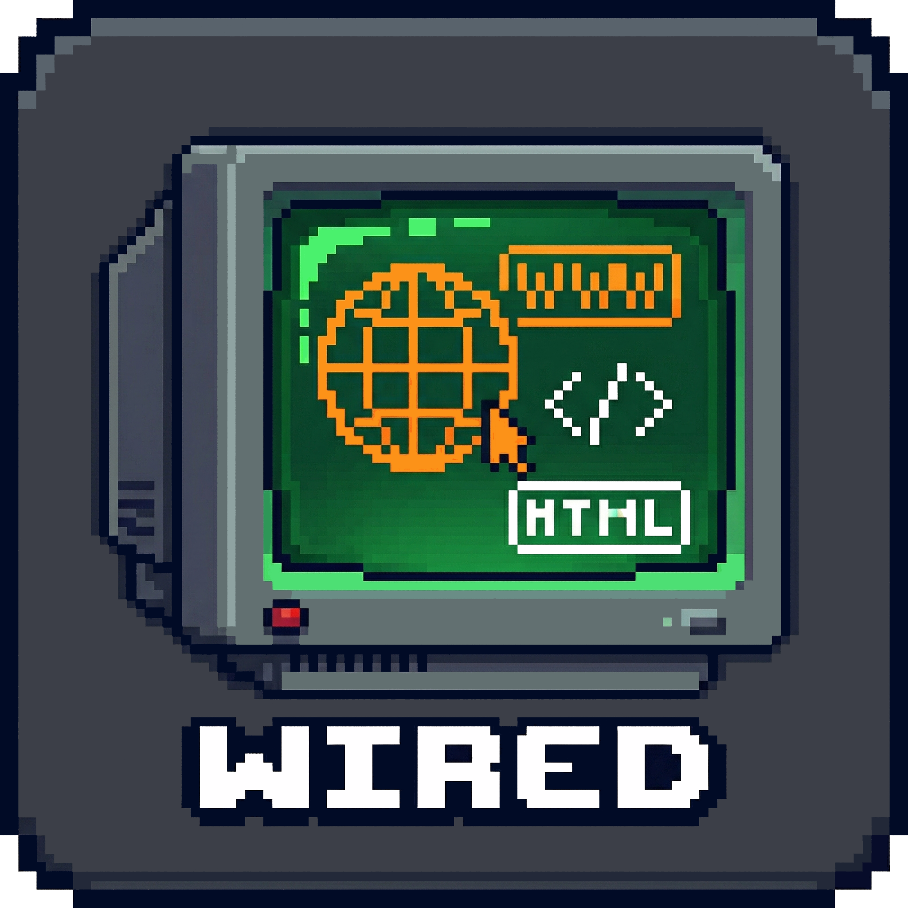

<div align="center">
  
  <h1>Retro Web Editor</h1>
  <p><strong>A free, open-source, lightweight WYSIWYG HTML editor for desktop.</strong></p>
  <p>Edit HTML, CSS, and JavaScript files visually or in code with real-time live preview — no browser or server required.</p>
  <p>
    <a href="https://github.com/jeremyriel/retro-web-editor/releases/latest"></a>
    <a href="copying/LICENSE_GNU_GPL_3.0.txt"></a>
    <a href="https://github.com/jeremyriel/retro-web-editor/releases"></a>
  </p>
</div>

---

## Why Retro Web Editor?

Sometimes you just want to quickly edit web files on desktop visually!

I made this app initially for myself because the longstanding desktop web publishing apps have been discontinued (Dreamweaver CS6, BlueGriffon), are cloud-only, or are embedded within heavyweight software development tools that consume a lot of system resources.

Retro Web Editor fills a gap as a **focused, fast, desktop-native WYSIWYG editor** that opens your local HTML files and lets you edit them visually — with the code always visible and in sync.

**Built for web designers, educators, students, and front-end developers** who want a simple, capable tool for quick editing of HTML and CSS without the overhead of a full IDE.

---

## Screenshots

<!-- Add screenshots here when available -->
*Screenshots coming soon.*

---

## Features

### Code + Visual Editing

- **Split-pane interface** — code editor and live preview side by side, resizable or switchable to code-only or preview-only modes
- **Bidirectional sync** — edit code and watch the preview update instantly; click elements in the preview and the code editor scrolls to that element's source
- **CodeMirror 6 editor** — syntax highlighting for HTML, CSS, and JavaScript with autocomplete, search, bracket matching, and line wrapping
- **Live preview** — rendered in a sandboxed iframe with 300ms debounced updates and CSS hot-swap (no full reload for style-only changes)

### Visual Design Tools

- **Formatting toolbar** — Bold, Italic, Underline, Strikethrough, Headings (H1–H6), Insert Link/Image/Table/Div/List, Text Alignment
- **Property panel** — click any element in the preview to inspect and edit its CSS properties (Box Model, Typography, Layout, Colors, Position) and HTML attributes in real time
- **Color picker** — native color input with hex/rgb text field for background-color and color properties
- **Drag-and-drop reordering** — drag elements in the preview to rearrange them, and the source code updates automatically
- **Link editor** — select text in the preview, press Ctrl+K (Cmd+K on Mac) to insert or edit links with URL, mailto, tel, and anchor types, target window, rel attributes, and title tooltip
- **DOM outlines** — toggle visible outlines on all block elements to see the page structure
- **Grid overlay** — 20px reference grid for visual alignment

### Google Fonts Integration

- Browse and search the full **Google Fonts** library (1,700+ fonts) from within the editor
- Filter by category: Sans Serif, Serif, Display, Handwriting, Monospace
- Live font previews rendered in each font
- One-click **"Add & Use"** — inserts the `<link>` tag into your document's `<head>` and applies `font-family` to the selected element
- **Document Fonts** section shows fonts already linked in your HTML for quick reuse

### File Management

- **Multi-tab editing** — open multiple HTML, CSS, and JS files simultaneously with dirty-state indicators
- **Smart file linking** — opening an HTML file auto-detects and opens its linked CSS and JavaScript files as additional tabs
- **Open Recent** — modal with up to 10 recently edited files, one-click open or remove
- **Autosave** — automatic backup every 2 minutes to a temp file, plus an immediate save when files are opened
- **Autosave recovery** — if Retro Web Editor detects an unsaved autosave that differs from the saved file, it prompts you to restore or discard the recovery
- **Save-on-exit** — native Save / Don't Save / Cancel dialog for unsaved files

### WCAG Accessibility Validator

- Built-in **WCAG 2.1 Level AA** validator powered by [axe-core](https://github.com/dequelabs/axe-core)
- Results grouped by impact (critical, serious, moderate, minor) with rule descriptions and WCAG tags
- Download validation report as a `.txt` file
- Re-run button for iterative fixing

### Theming & Accessibility

- **Light and Dark themes** — persisted across sessions, with One Dark for the code editor in dark mode
- **WCAG 2.1 AA accessible** — skip navigation, ARIA landmarks and labels, focus trapping in modals, keyboard navigation for tabs and split pane, focus indicators, reduced motion support, 4.5:1+ text contrast and 3:1+ UI component contrast
- **Zoom controls** — independent zoom for code editor (font size) and preview (CSS transform), with floating controls and keyboard shortcuts

### Developer Experience

- **Keyboard Shortcuts popup** — press Ctrl+/ (Cmd+/) or click the keyboard icon in the toolbar to see all shortcuts
- **Help Hovers** — press F1 to enable descriptive tooltips on every UI element
- **About dialog** — version info, license, author website
- **Window state persistence** — remembers position, size, maximized state, and theme preference

---

## Keyboard Shortcuts

All `Ctrl` shortcuts use `Cmd` on macOS.

| Action | Shortcut |
|---|---|
| Open File | Ctrl+O |
| Open Recent | Ctrl+Shift+O |
| Save | Ctrl+S |
| Save As | Ctrl+Shift+S |
| Undo / Redo | Ctrl+Z / Ctrl+Shift+Z |
| Bold / Italic / Underline | Ctrl+B / Ctrl+I / Ctrl+U |
| Insert/Edit Link | Ctrl+K |
| Toggle Code/Preview | Ctrl+\\ |
| Code Only / Split / Preview Only | Ctrl+1 / Ctrl+2 / Ctrl+3 |
| Grid Overlay | Ctrl+G |
| DOM Outlines | Ctrl+Shift+G |
| Properties Panel | Ctrl+P |
| Keyboard Shortcuts | Ctrl+/ |
| Zoom In/Out Code | Ctrl+= / Ctrl+- |
| Reset Code Zoom | Ctrl+0 |
| Zoom In/Out Preview | Ctrl+Shift+= / Ctrl+Shift+- |
| Reset Preview Zoom | Ctrl+Shift+0 |
| Help Hovers | F1 |
| Toggle Fullscreen | F11 |

---

## Installation

### Download Pre-Built Installers

Download the latest version for your platform from the [Releases page](https://github.com/jeremyriel/retro-web-editor/releases/latest):

| Platform | Download | Notes |
|---|---|---|
| **Windows** (installer) | `RetroWebEditor-Setup-x.x.x.exe` | Guided installer with desktop shortcut |
| **Windows** (portable) | `RetroWebEditor-x.x.x-portable.exe` | No installation needed — runs from any folder |
| **macOS** | `RetroWebEditor-x.x.x-mac.dmg` | Open the DMG and drag to your Applications folder |
| **Linux** | `RetroWebEditor-x.x.x.AppImage` | Make executable with `chmod +x` and run |

### Windows Installation

1. Download the `.exe` installer from the link above
2. Run the installer — you'll see the license agreement (GNU GPL v3.0)
3. Choose an install location (the default is fine for most users)
4. A desktop shortcut and Start Menu entry will be created automatically
5. Launch Retro Web Editor from the desktop or Start Menu

### macOS Installation

1. Download the `.dmg` file from the link above
2. Open the DMG file
3. Drag the Retro Web Editor icon into your Applications folder
4. Launch from Applications (you may need to right-click > Open the first time, since the app is not signed with an Apple Developer certificate)

### Linux Installation

1. Download the `.AppImage` file from the link above
2. Make it executable: `chmod +x RetroWebEditor-*.AppImage`
3. Run it: `./RetroWebEditor-*.AppImage`

---

<details>
<summary><strong>Build from Source</strong> (for developers)</summary>

### Prerequisites

- [Node.js](https://nodejs.org/) 18 or later
- [Git](https://git-scm.com/) (to clone the repository)

### Clone and Install

```bash
git clone https://github.com/jeremyriel/retro-web-editor.git
cd retro-web-editor
npm install
```

### Run in Development Mode

```bash
npm run dev
```

This starts Retro Web Editor with hot-reload enabled — code changes in `src/renderer/` are reflected instantly.

### Build for Production

```bash
npm run build
```

### Package for Distribution

```bash
npm run package:win     # Windows (.exe installer + portable)
npm run package:mac     # macOS (.dmg + .zip)
npm run package:linux   # Linux (.AppImage + .deb)
npm run package:all     # All platforms
```

Packaged apps are output to the `release/` directory.

</details>

---

## Getting Started — Your First Project

### 1. Create Your HTML File

Create a new file called `index.html` in any folder on your computer:

```html
<!DOCTYPE html>
<html lang="en">
<head>
  <meta charset="UTF-8">
  <meta name="viewport" content="width=device-width, initial-scale=1.0">
  <title>My First Page</title>
  <link rel="stylesheet" href="style.css">
</head>
<body>
  <h1>Hello, World!</h1>
  <p>This is my first page in Retro Web Editor.</p>
</body>
</html>
```

Create a `style.css` in the same folder:

```css
body {
  font-family: sans-serif;
  max-width: 800px;
  margin: 0 auto;
  padding: 2rem;
}

h1 {
  color: #0066cc;
}
```

### 2. Open in Retro Web Editor

Launch Retro Web Editor and press **Ctrl+O** (Cmd+O on Mac) to open `index.html`. It will automatically detect `style.css` and open it as a second tab.

### 3. Edit Visually

- **Click any element** in the live preview on the right — the code editor scrolls to its source, and the Properties panel opens with its CSS and HTML attributes
- **Change CSS properties** in the Properties panel — your code updates in real time
- **Use the toolbar** to insert new elements, format text, or change alignment
- **Drag elements** in the preview to reorder them in the DOM

### 4. Add a Google Font

1. Click any text element in the preview
2. In the Properties panel, find **font-family** under Typography
3. Click the **search icon** button next to the input
4. Search for a font (e.g., "Inter"), click **Add & Use**
5. The Google Fonts `<link>` tag is inserted into your `<head>` and the font is applied

### 5. Add a Link

1. Select some text in the preview
2. Press **Ctrl+K** (Cmd+K on Mac)
3. Enter the URL, choose the link type, and click **Apply**

### 6. Save

Press **Ctrl+S** to save. Retro Web Editor also autosaves every 2 minutes to a temp file, so you won't lose work if something goes wrong.

---

## Tech Stack

| Component | Technology | Notes |
|---|---|---|
| Desktop framework | Electron 34 | Cross-platform (Windows, macOS, Linux) |
| Code editor | CodeMirror 6 | ~150 KB core vs Monaco's 5–10 MB |
| Live preview | Sandboxed iframe | Same renderer process (saves ~30–50 MB vs webview) |
| Bundler | electron-vite (Vite 6) | Fast HMR for development |
| UI framework | Vanilla TypeScript | No React/Vue/Angular overhead |
| Persistence | electron-store | Window state, recent files, theme |
| Accessibility | axe-core | WCAG 2.1 AA validation engine |
| Packaging | electron-builder | Windows installer + portable, macOS DMG, Linux AppImage |

---

## Project Structure

```
retro-web-editor/
├── src/
│   ├── main/              # Electron main process (file I/O, menus, IPC)
│   ├── preload/           # Secure contextBridge API
│   ├── renderer/          # All UI code
│   │   ├── editor/        # CodeMirror wrapper, tab management
│   │   ├── preview/       # iframe preview, drag-drop, grid overlay
│   │   ├── toolbar/       # Formatting toolbar
│   │   ├── properties/    # CSS + attribute property panel
│   │   ├── layout/        # Resizable split pane
│   │   └── sync/          # Bidirectional sync engine + HTML parser
│   └── shared/            # Types, constants shared across processes
├── copying/               # GNU GPL 3.0 license text
├── resources/             # App icons (ico, icns, png)
└── package.json
```

---

## How Bidirectional Sync Works

The core innovation is the **bidirectional sync engine** that keeps the code editor and visual preview in perfect lockstep:

1. **Code to Preview** — When you type in the code editor, a 300ms debounced update rebuilds the source map and refreshes the preview iframe. CSS-only changes are hot-swapped without a full reload.

2. **Preview to Code** — When you click or drag an element in the preview, a CSS selector path is computed for that DOM node and matched to a source position in the HTML via a custom parser with offset tracking. The code editor then scrolls to and selects the corresponding source.

3. **Property to Code** — When you change a CSS property or HTML attribute in the Properties panel, the change is written directly into the source code at the correct offset, and the preview updates from the new code.

4. **Loop Prevention** — Every edit is tagged with its origin (`code`, `visual`, or `property`). The sync engine ignores updates that originated from the destination it's about to write to, preventing infinite loops.

---

## Contributing

Contributions are welcome! Please open an issue to discuss proposed changes before submitting a pull request.

### Development Setup

```bash
git clone https://github.com/jeremyriel/retro-web-editor.git
cd retro-web-editor
npm install
npm run dev
```

The app launches with hot-reload. Changes to renderer code update instantly; main process changes require a restart.

---

## License

Retro Web Editor is free software released under the **GNU General Public License v3.0**.

You can redistribute it and/or modify it under the terms of the GPL as published by the Free Software Foundation, either version 3 of the License, or (at your option) any later version.

See [LICENSE](LICENSE) for the full license text, or visit https://www.gnu.org/licenses/gpl-3.0.html.

---

## Author

**Jeremy Riel**
[www.jeremyriel.com](https://www.jeremyriel.com)
